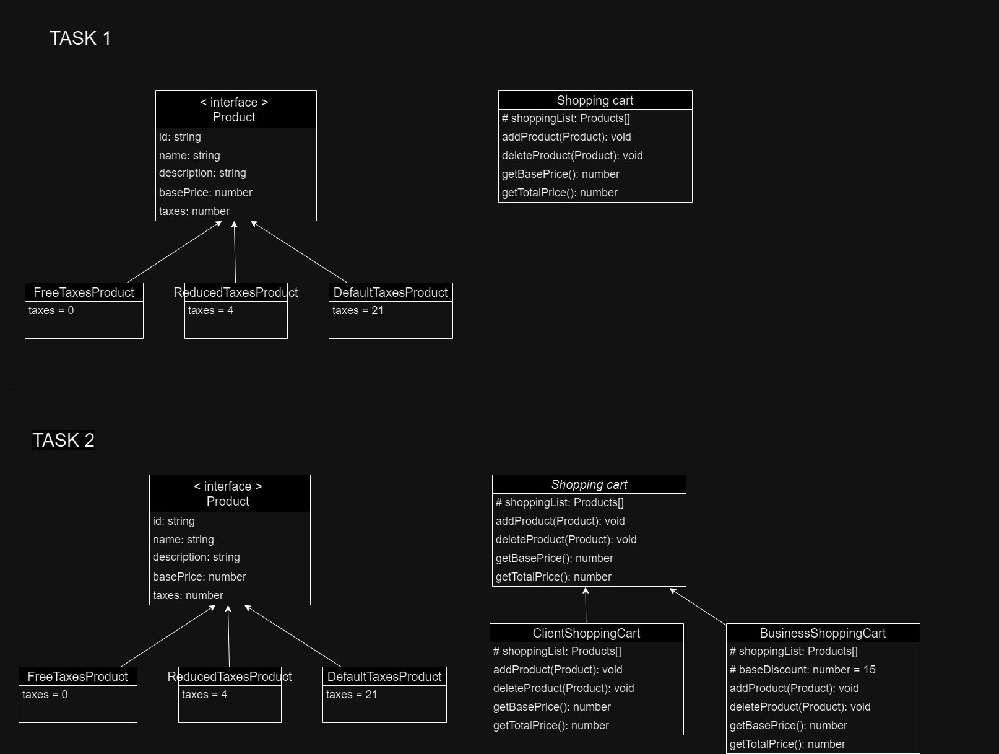

# Shopping Cart

Vamos a crear un programa que simule un carrito de la compra. El programa debe permitir al usuario los siguientes casos de uso:

- Añadir un producto al carrito
- Quitar un producto del carrito
- Calcular el precio base y el total (incluyendo descuentos e impuestos)

Los productos tendrán la siguiente información (id: string, name: string, description: string, basePrice: number, taxes: number)

Tendremos 3 tipos de productos:

Productos libres de impuestos
Productos con impuesto hiperreducido (4%)
Productos con impuesto habitual (21%)

**TASK 1**: Construye un Diagrama UML de clases con el diseño de la aplicación.

Al cabo de unos meses, nuestro PO nos transmite una nueva necesidad:

Debemos poder añadir un nuevo tipo de carrito de la compra exclusivo para negocios.

Este carrito tiene la particularidad de disponer de un 15% de descuento directo sobre la base de todo el carrito.

**TASK 2**: ¿Cómo modificarías tu diseño anterior para cubrir la nueva necesidad?. ¿El diseño de la Task 1 viola algún principio SOLID?

En la primera fase hemos creado una clase para Shopping cart, en la segunda la hemos cambiado por una clase abstracta que la implementen ClientShoppingCart y ByusinessShoppingCart. De la primera manera estabamos violando la O de Open/Closed porque hubiéramos tenido que modificar el codigo para hacer este cambio y la L de la substitucion de Liskov porque si hubiesemos creado la clase BusinessShoppingCart extendiendo de ShoppingCart, en el caso de no ser abstracta, cambiaría la implementacion de getBasePrice y getTotalPrice.

**TASK 3**: Implementa siguiendo TDD el diseño de la Task 2
